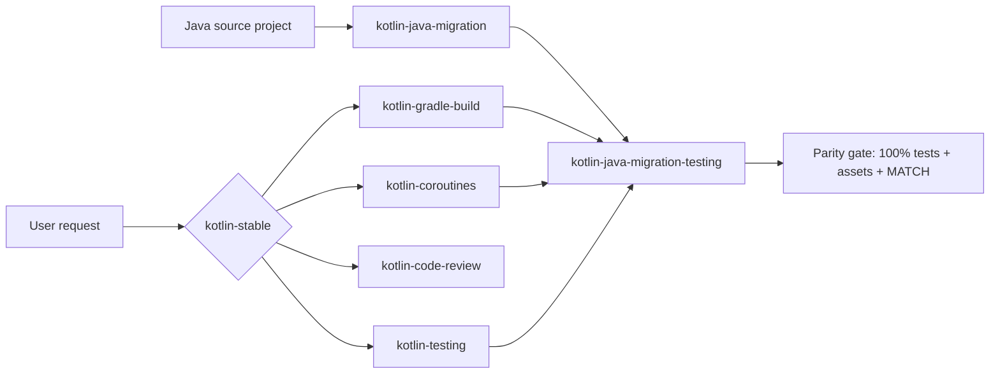

# Repository architecture

The core skills solve Kotlin-native engineering tasks independently. The two migration skills compose them: implementation owns the source-object and contract ledger; acceptance owns source-test parity, copied assets, whole-project `<project>-test` execution, differential comparison, and Kotlin-only risk tests.

